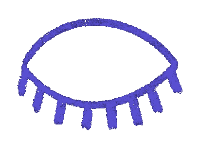
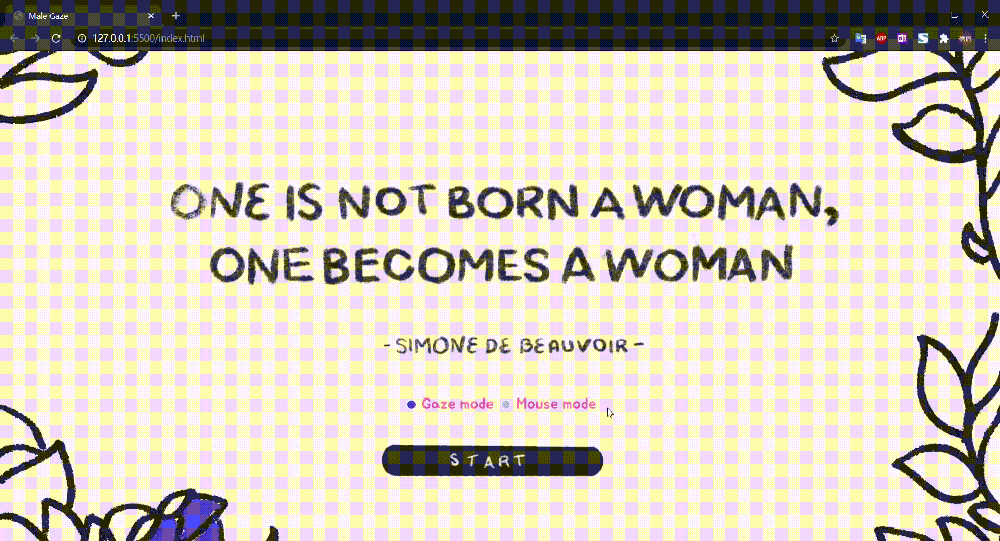

# Male Gaze

  

The male gaze is a concept coming from the film industry that elaborates how women are depicted as sexual objects from a masculine perspective. Nowadays, we can see male gazes almost everywhere in daily life, from visual arts to social media. It implicitly influences and shapes the female community, contributing to some familiar issues such as objectification of women and body shaming. To raise the awareness of the male gaze’s impact on women and improve their own body’s subjectivity, we designed an interactive website that allows people to experience the male gaze digitally. Users can see how a female body shape is becoming more and more stereotypical feminine by interacting with their real gazes. The evaluation results prove that our design has a positive impact on users and they feel encouraged after trying it out.  
  
Try it [here](https://liubq7.github.io/Male-Gaze/)!  
For more details, please see [design process](https://github.com/liubq7/Male-Gaze/blob/master/Design_Process.pdf) and [essay](https://github.com/liubq7/Male-Gaze/blob/master/Essay.pdf).  

    

